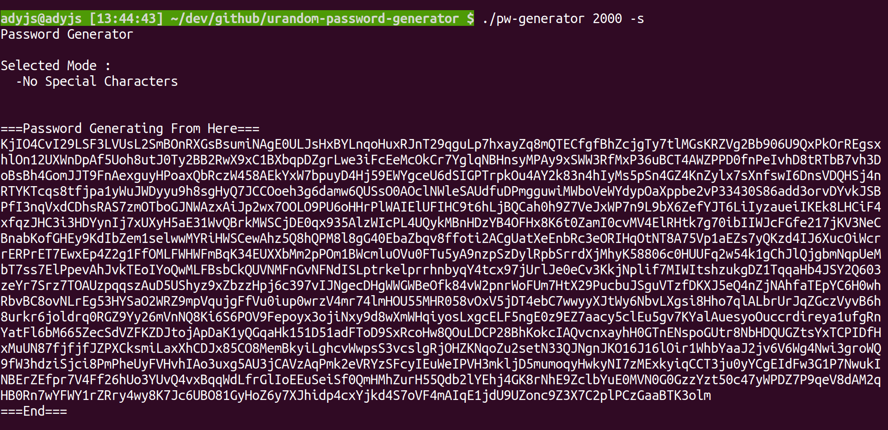
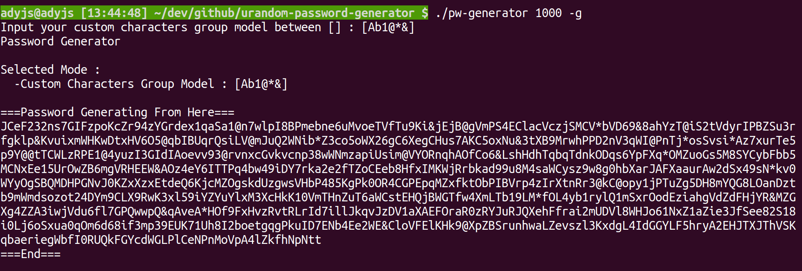

# urandom-password-generator

    A Password Generator On Local Terminal based-on /dev/urandom

## HOW TO USE THIS SOFTWARE

### 1. Install packages

    Built-in libraries is enough (Ubuntu), No need for other installation.

    My system env is "Ubuntu 20.04.3 LTS (Focal Fossa)"

### 2. Download This Repository

```
$ git clone THIS_REPOSITORY

$ cd urandom-password-generator/ && make
```


### 3. Setting Output Password Length And The Options

* How Long The Password length That You Want
```
Password Length : 1 ~ 2600 byte

$ ./pw-generator PASSWORD_LEN

$ ./pw-generator 100
```

* Options About The Output of Characters 
```
-h : Get Helper
-s : No Special Characters
-n : No digit Number Characters
-u : No Uppercase Alphabet Characters
-l : No Lowercase Alphabet Characters
-c : Customthe output of ASCII printable characters
-g : Customthe output of group of ASCII printable characters

$ ./pw-generator PASSWORD_LEN [-option_1 | -option_2 | ...]

$ ./pw-generator 100 -s 
$ ./pw-generator 1000 -u -s
$ ./pw-generator 10 -l -u 
$ ./pw-generator 500 -c 
$ ./pw-generator 2600 -g 

There is some using notice needs to read before you use it, 
please check by using "$ ./pw-generator -h" for help
```
* ruled-out special characters


* custom characters group model
  


Enjoy it,  
if this meet your need.  :)