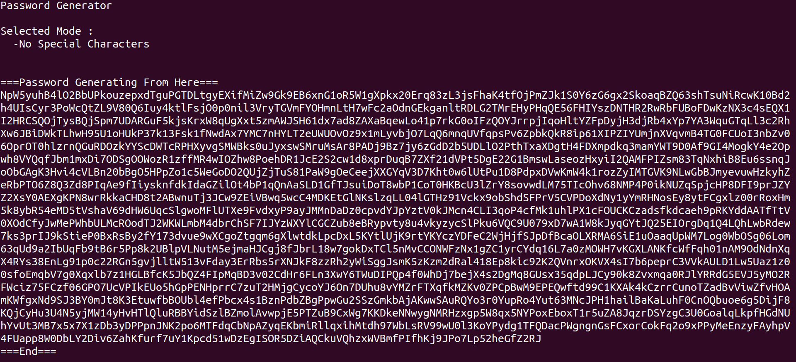

# PW-Gen

A Password Generator On Local Terminal based on /dev/urandom


## HOW TO USE THIS SOFTWARE

### 1. Install packages

Built-in libraries is enough (Ubuntu), No need for other installation.


### 2. Download This Repository

```
$ git clone THIS_REPOSITORY

$ cd pw-gen/ && make
```


### 3. Setting The Options

* How Long The Password length That You Want
```
Password Length : 1 ~ 2600 byte

$ ./pw-gen PASSWORD_LEN

$ ./pw-gen 100
```

* Options About The Output of Characters 
```
-h : Get Helper
-s : No Special Characters
-n : No digit Number Characters
-u : No Uppercase Alphabet Characters
-l : No Lowercase Alphabet Characters

$ ./pw-gen PASSWORD_LEN [-option_1 | -option_2 | ...]

$ ./pw-gen 100 -s 
$ ./pw-gen 100 -u 
$ ./pw-gen 100 -l -u 
```




Enjoy it,  
if this meet your need.  
:)