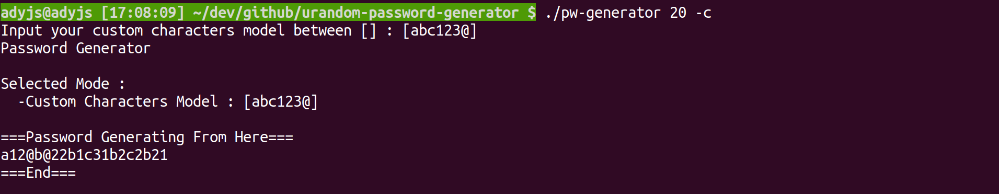
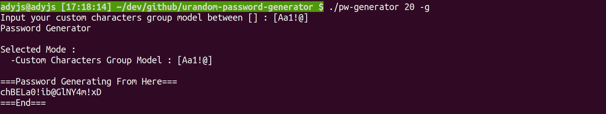

# urandom-password-generator

    A Password Generator On Local Terminal based-on /dev/urandom

## HOW TO USE THIS SOFTWARE

### 1. Install packages

    Built-in libraries is enough (Ubuntu), No need for other installation.

    My system env is "Ubuntu 20.04.3 LTS (Focal Fossa)"

### 2. Download This Repository

```
$ git clone THIS_REPOSITORY

$ cd urandom-password-generator/ && make
```


### 3. Setting Output Password Length And The Options

* How Long The Password length That You Want
```
Password Length : 1 ~ 2600 byte

$ ./pw-generator PASSWORD_LEN

$ ./pw-generator 100
```

* Options About The Output of Characters 
```
-h : Get Helper
-s : No Special Characters
-n : No digit Number Characters
-u : No Uppercase Alphabet Characters
-l : No Lowercase Alphabet Characters
-c : Custom the output of ASCII printable characters
-g : Custom the output of group of ASCII printable characters

$ ./pw-generator PASSWORD_LEN [-option_1 | -option_2 | ...]

$ ./pw-generator 100 -s 
$ ./pw-generator 1000 -u -s
$ ./pw-generator 10 -l -u 
$ ./pw-generator 500 -c 
$ ./pw-generator 2600 -g 

There is some using notice needs to read before you use it, 
please check by using "$ ./pw-generator -h" for help
```
* ruled-out special characters


* custom characters model
  

* custom characters group model
  


Enjoy it, if this meet your need,  
That will be great if give me the thumbs up :)


# 隨機字元密碼產生器

    基於 /dev/urandom 之隨機字元密碼產生器

## 如何使用此軟體

### 1. 套件安裝

    Ubuntu 內建的程式庫套件已經足夠，通常不需要在另外安裝其他套件。
    我的系統環境是 "Ubuntu 20.04.3 LTS (Focal Fossa)"

### 2. 下載此程式庫

```
$ git clone 此程式庫

$ cd urandom-password-generator/ && make
```

### 3. 設定要輸出的密碼長度及選項

* 想要輸出多長的隨機密碼字元
```
密碼長度 : 1 ~ 2600 byte

$ ./pw-generator 密碼長度

$ ./pw-generator 100
```

* 程式輸出選項
```
-h : 程式使用說明
-s : 不輸出特殊符號字元
-n : 不輸出數字字元
-u : 不輸出大寫英文字母字元
-l : 不輸出小寫英文字母字元
-c : 自訂輸出 ASCII 可顯示字元
-g : 自訂輸出 ASCII 可顯示字元之組合

$ ./pw-generator 密碼長度 [-選項_1 | -選項_2 | ...]

$ ./pw-generator 100 -s 
$ ./pw-generator 1000 -u -s
$ ./pw-generator 10 -l -u 
$ ./pw-generator 500 -c 
$ ./pw-generator 2600 -g 

在使用前必須要請您閱讀使用說明，
請用 terminal 中輸入  "$ ./pw-generator -h" 觀看使用說明
```
* 排除特殊符號字元


* 自訂字元模式
  

* 自訂字元組合模式
  


如果此軟體有符合您的需求，請盡量使用，
如果給我個讚那就更讚了 ：）
